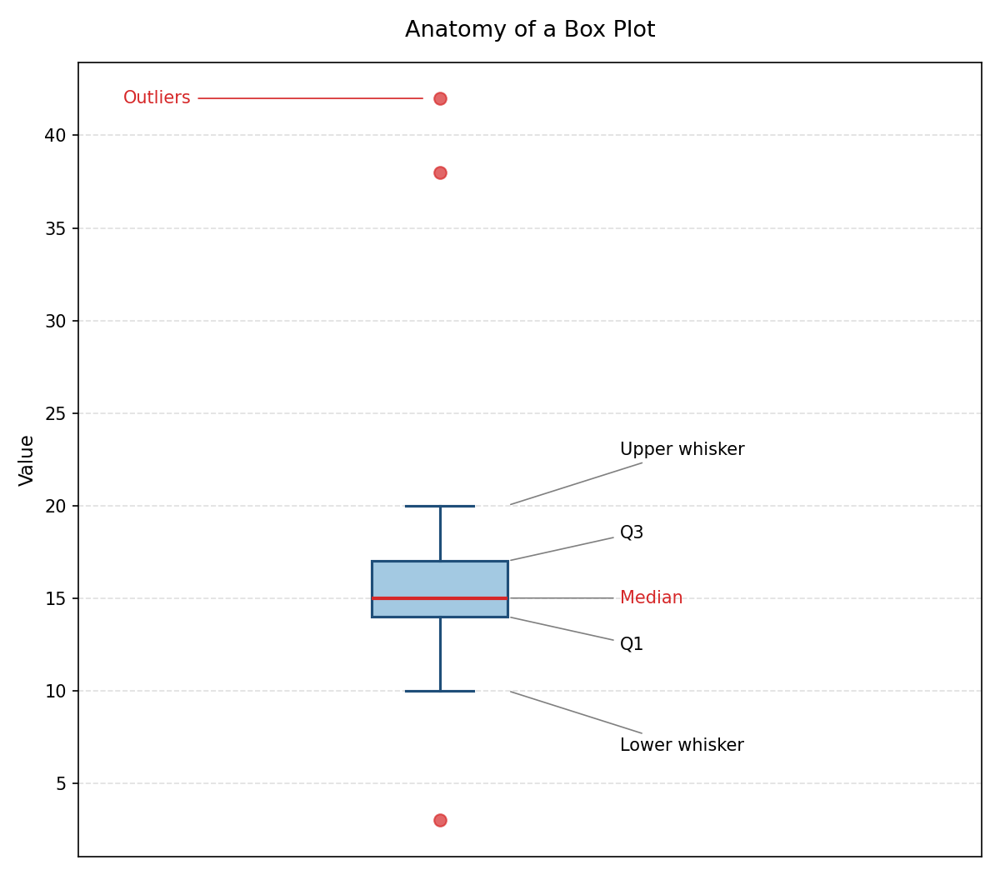
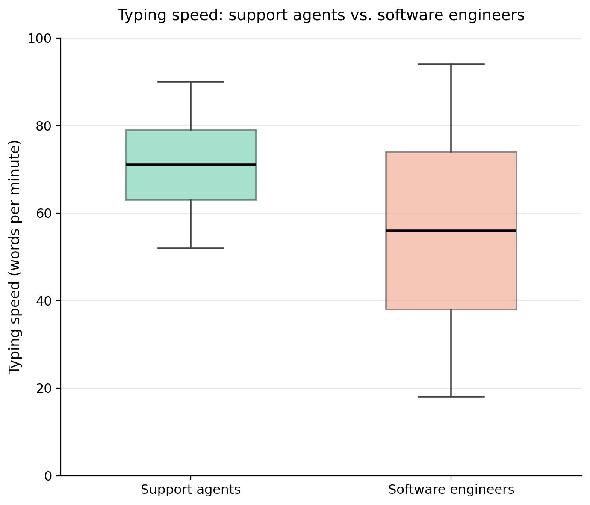

# Summary Statistics

We've given a few examples of ways to visualize data, now we want to talk about some important **summary statistics**. Summary statistics are quantitative values one can use help describe the shape of a distribution. We will talk about measures of **center** and measures of **spread**.

Almost always, summary statistics can only be used on *quantitative data*. 

## Measures of Center

The goal of measures of *center* is to describe the value of a typical datapoint. There are three measures of center we will cover:

* **Mode**: The value(s) with the highest frequency in the dataset. Mode is the *only* measure of center that can be used with categorical data. 
* **Mean**: The average of the values. If a dataset has $n$ values $x_1$, $x_2$, $\dots$, $x_n$, then the mean $\bar{x}$ is given by 

$$\bar{x} = \frac{x_1+x_2+ \cdots + x_n}{n}.$$

* **Median**: The midpoint of the distribution. It is the number such that half the observations fall above and half fall below. 

::: {#exm-ages}
## Classroom Ages
A college class has 22 students with the following ages: 18, 22, 21, 21, 21, 18, 20, 42, 23, 44, 18, 18, 21, 18, 22, 18, 22, 23, 20, 38, 20, 34. Compute the mean, median, and mode. 

[See this data on StatCrunch to perform the computations there.](https://www.statcrunch.com/app/index.html?dataid=5133686){target="_blank"}
:::

::: {.callout-tip collapse="true"}
## Answer 
To compute the mode and median it helps to order the data from smallest to largest. 

$$18, 18, 18, 18, 18, 18, 20, 20, 20, 21, 21, 21, 21, 22, 22, 22, 23, 23, 34, 38, 42, 44$$

The mode is 18, which occurs in the dataset 6 times. 

Since the dataset is 22 students, the median is the value in-between the 11th and 12th observations. The 11th and 12th observation both happen to be 21, therefore the median is 21.

The mean is,

$$\frac{6 \cdot 18 + 3 \cdot 20 + 4 \cdot 21 + 3 \cdot 22 + 2 \cdot 23  + 34 + 42 + 44}{22} = \frac{522}{22} = 23.73.$$

Notice that the mean is slightly larger than the median this is because there are a handful of older students with *outlier* ages. The mean gets pulled by outliers more than the median does.
:::

::: {.callout-important title="Median on Datasets of Even Size"}
For this course, to compute the median when the dataset has an *even* number of observations average the two observation in the middle. This is a typical convention chosen in statistics. 
:::

The difference between the median and mean of a distribution can reveal information about the shape of the distribution. In particular, if a distribution is **skewed** or **symmetric**. 

```{r}
#| label: fig-income
#| fig-cap: "Right-skewed household income distribution."
#| echo: false
#| fig-width: 6

income <- c(20.7, 21.4, 22.4, 26.3, 26.8, 28.4, 28.6, 28.6, 33.2, 33.8,
            34.6, 35.0, 36.7, 37.9, 39.7, 40.0, 40.1, 41.7, 42.8, 44.7,
            45.3, 47.1, 47.4, 48.5, 52.5, 78.0, 92.0, 110.0, 145.0, 210.0)

inc_mean   <- mean(income)
inc_median <- median(income)

hist(income,
     breaks = 10,
     main = "Household Income Distribution",
     xlab = "Income ($1000s)", ylab = "Frequency")

abline(v = inc_mean,   col = "red",  lwd = 3, lty = 1)
abline(v = inc_median, col = "blue", lwd = 3, lty = 2)

legend("topright",
       legend = c(paste0("Mean = ",   round(inc_mean, 1)),
                  paste0("Median = ", round(inc_median, 1))),
       col = c("red", "blue"), lwd = 3, lty = c(1, 2), bty = "n")
```

When a distribution is skewed, the mean is pulled more towards the **tail** than the median. 

```{r}
#| label: fig-heights
#| fig-cap: "Approximately symmetric distribution of soccer team heights."
#| echo: false
#| fig-width: 6

heights <- c(58.9, 60.2, 60.8, 61.5, 62.0, 62.3, 62.7, 63.1, 63.4, 63.6,
             63.9, 64.1, 64.3, 64.4, 64.5, 64.7, 64.8, 65.0, 65.2, 65.5,
             65.7, 66.0, 66.3, 66.6, 67.0, 67.4, 67.9, 68.6, 69.3, 70.8)

ht_mean   <- mean(heights)
ht_median <- median(heights)

hist(heights,
     breaks = seq(58, 72, by = 1),
     main = "Soccer Team Player Heights",
     xlab = "Height (inches)", ylab = "Frequency")

abline(v = ht_mean,   col = "red",  lwd = 3, lty = 1)
abline(v = ht_median, col = "blue", lwd = 3, lty = 2)

legend("topright",
       legend = c(paste0("Mean = ",   round(ht_mean, 1)),
                  paste0("Median = ", round(ht_median, 1))),
       col = c("red", "blue"), lwd = 3, lty = c(1, 2), bty = "n")
```

::: {.callout-important title="Mean Versus Median"}
The reason **outliers pull the mean more than the median** is because mean minimizes the error *squared*, while the median minimizes the absolute error. Squaring the error means outliers will have extra impact. This fact is outside of the scope of this course, but I am happy to chat about it for curious minds!
:::

::: {#exm-createdata1}
## Creating Data
Using StatCrunch complete the following:

1. Create a dataset of 10 student ages where the median is 20 and at least one student is not 20.

2. Is it possible to do this and have no student be 20 years old? 

3. If we increased the size of the dataset to 15 students can you still create a dataset with median 20 *and* no students are 20 years old?
:::

::: {.callout-tip collapse="true"}
## Answer

1. One possible answer: 18, 18, 18, 19, 20, 20, 20, 21, 22, 23.

2. Yes it is! Since the dataset has an *even* size, we can make it so the 5th entry is 19 and the 6th entry is 21. Such as: 18, 18, 18, 19, 19, 21, 22, 23, 25.

3. This is **not** possible if the dataset has an *odd* size. When there are 15 students, the age of the 8th youngest student is the median--so that student must be 20. 
:::

::: {#exm-createdata2}
1. Using StatCrunch or Google Sheets, create a dataset of 25 non-negative integers (e.g. whole numbers 0 and larger) where the mean is less than the median. Plot the histogram of the data. 

2. (Challenge) If I have a dataset of 25 **non-negative integers** and the median is 50, what is the smallest possible mean?
:::

::: {.callout-tip collapse="true"}
## Answer
1. Your dataset should be **skewed to the left** in this example. 

2. The smallest possible mean occurs when 12 data points have value 0 and 13 have the value 50. This guarantees the median is 50. So the mean is 

$$\frac{12 \cdot 0 + 13 \cdot 50}{25} = 26.$$

We can't make any of numbers smaller or else we would either change the median or break the non-negative rule. Making any of the numbers bigger would increase the mean! 
::: 

::: {.callout-important title="When to use mode?"}
Discuss: what might be a situation where the mode is the most relevant summary statistic to use?
:::

::: {.callout-tip collapse="true"}
Mode is the only measure of center that can be used for categorical data. Also, mode is great for bimodal (or multimodal) distributions!
:::

::: {.callout-important title="Nobody's Average"}
In 1950 the airforce measured 140 physical dimension of 4063 pilots and designed the cockpit to match he average (mean) dimensions. Lieutenant Gilbert S. Daniels then compared this "average pilot" to individual pilot records to show that no pilot was within 15% of the average on the ten most relevant dimensions. In other words, the cockpits were designed to fit no one! Thus lead to the adaptation of adjustable seats. 
:::

## Measures of Spread

::: {#exm-spreaddiff}
## Commute Times
[Data on StatCrunch.](https://www.statcrunch.com/app/index.html?dataid=5133808){target="_blank"} The below histograms depict the commute time of 500 people who work in Town A and Town B. How are the datasets similar and how are they different?

```{r}
#| label: fig-commute-spread
#| fig-cap: "Commute times in two different towns."
#| echo: false
#| fig-width: 9

set.seed(42)

rnorm_positive <- function(n, mean, sd) {
  out <- numeric(0)
  while (length(out) < n) {
    draw <- rnorm(n * 2, mean = mean, sd = sd)
    out <- c(out, draw[draw > 0])
  }
  out[1:n]
}

# Create data
town_a <- round(rnorm_positive(500, mean = 30, sd = 4)) 
town_b <- round(rnorm_positive(500, mean = 30, sd = 12))  

par(mfrow = c(1, 2))

# Town A hist
hist(town_a,
     main = "Town A Commute times",
     xlab = "Minutes", ylab = "Frequency",
     xlim = c(0,80))

# Town B hist
hist(town_b,
     main = "Town B Commute times",
     xlab = "Minutes", ylab = "Frequency",
     xlim = c(0,80))
```
:::

The above example illustrates that it is important to have statistics that describe the *spread* of a distribution. There are a few we will investigate today.

### Range

The **range** of a dataset is the largest observation minus the smallest observation. 

```{r}
#| echo: false

commute_data <- data.frame(
  town_a_minutes = town_a,
  town_b_minutes = town_b
)

write.csv(commute_data, "commute_times.csv", row.names = FALSE)
```

::: {#exm-commutetimes}
[The commute times data is given here.](https://www.statcrunch.com/app/index.html?dataid=5133808){target="_blank"} Compute the range of the commuting data for each town. 
:::

::: {.callout-tip collapse="true"}
## Answer
For Town A, the longest and shortest commute times are 42 and 18 minutes, respectively. So the range for Town A is $42-18 = 24$.

For Town B, the longest and shortest commute times are 62 and 1 minute, respectively. So the range for Town B is $62-1 = 61$. 
:::

Range does give us an initial look at the spread of the distribution, but **outliers** can obfuscate how range relates to spread. Consider two classes with the following histograms of exam scores:

```{r}
#| label: fig-quiz-spread
#| fig-cap: "Scores on Exam 1 in Class A and Class B"
#| echo: false
#| fig-width: 9


class_a <- c(10, 82, 83, 80, 91, 76, 70, 74, 80, 86,
             66, 71, 79, 87, 83, 96, 73, 77, 80, 44)
class_b <- c(10, 34, 36, 44, 45, 48, 50, 56, 66, 64,
             76, 77, 80, 84, 88, 89, 91, 95, 82, 83)

par(mfrow=c(1,2))

hist(class_a, breaks = seq(0, 100, by = 5),
     xlim = c(0, 100),
     xlab = "Exam 1 Scores in Class A", ylab = "Count")

hist(class_b, breaks = seq(0, 100, by = 5),
     xlim = c(0, 100),
     xlab = "Exam 1 Scores in Class B", ylab = "Count")
```

The range of both distributions is (approximately) the same, but the spread looks very different. Only 2 out of 20 students scored below a 60 in Class A, while 8 students (out of 20) scored below a 60 in Class B. 

### Inter-Quartile Range (IQR)

Recall that the **median** divides the observations into two parts of equal size. This is because we defined the median as the value which half the observations are below and half are above. **Quartiles** divide the data into 4 equal parts. Specifically we define:

* The first quartile (or lower quartile), Q1, is the value such that 25% of the data lies below this value. 
* The second quartile (or median), M, is value where 50% of the data lies below this value. 
* The third quartile (or upper quartile), Q3, is the value such that 75% of the data lies below this value. 

Computing the min, Q1, Q2, Q3, and max of a data set is known as the **five-number summary**. 

::: {.callout-important}
Note that Q1 and Q3 are computed differently on Google Sheets than on StatCrunch (and in this class). While they are effectively the same, it will sometimes cause incorrect homework answers. 
:::

::: {#exm-5num}
Below are the exact list of Exam 1 scores for Class A and Class B (from the histograms in Figure @fig-quiz-spread).  Compute the five-number summary for each class. What differences do you observe about the distribution from the statistics?

| Class A | Class B | Position Number |
|---------|---------|-----------------|
| 10      | 10      | 1 | 
| 44      | 34      | 2 |
| 66      | 36      | 3 |
| 70      | 44      | 4 |
| 71      | 45      | 5 |
| 73      | 48      | 6 |
| 74      | 50      | 7 |
| 76      | 56      | 8 |
| 77      | 64      | 9 |
| 79      | 66      | 10 |
| 80      | 76      | 11 |
| 80      | 77      | 12 |
| 80      | 80      | 13 |
| 82      | 82      | 14 |
| 83      | 83      | 15 |
| 83      | 84      | 16 |
| 86      | 88      | 17 |
| 87      | 89      | 18 |
| 91      | 91      | 19 |
| 96      | 95      | 20 |

:::

::: {.callout-tip collapse="true"}
## Answer 
Each class list is already ordered for us, so we have:

* Min = 1st grade --> Class A = 10, Class B = 10
* Q1 = between 5th and 6th grade --> Class A = 72, Class B = 46.5
* M = between 10th and 11th grade --> Class A = 79.5, Class B = 71
* Q3 = between 15th and 16th grade --> Class A = 83, Class B = 83.5
* Max = 20th grade --> Class A = 96, Class B = 95
:::

The **inter-quartile range** (IQR) is defined as Q3-Q1. 

::: {#exm-iqr}
Compute the IQR for the exam scores by class. 
:::

::: {.callout-tip collapse="true"}
## Answer
For Class A, IQR = Q3 - Q1 = 83 - 72 = 11. For Class B, IQR = 83.5 - 46.5 = 47.
:::

::: {.callout-important title="IQR Versus Range"}
Why might IQR be seen as a better gauge of spread than range? 
:::

### Outliers

An **outlier** is an oberservation that lies far away from the general distribution. The readings define outliers as points that are:

* Smaller than $\text{Q}1 - 1.5 \cdot (\text{IQR})$, or 
* Larger than $\text{Q}3 + 1.5 \cdot (\text{IQR})$.

<span style="color:red;">**Do not**</span> think of this as a set in stone rule. In fact, the multiplier 1.5 was not chosen with any real mathematical theory behind it. Use these values to flag *potential* outliers in the dataset, but context is an important factor when determining what is an outlier. Moreover, <span style="color:red;">**do not**</span> automatically remove outliers from a dataset 

::: {#exm-commutebimodal}
## Bimodal Commute Times
We have the following list of commute times for a neighborhood: 

--  --  --  --  --  --
24  25  26  27  27  28
28  29  29  30  30  30
31  31  32  32  33  33
34  34  35  35  36  36
37  38  39  40  41  42
72  74  76  78  80  82
--  --  --  --  --  --

Let's start by looking at the five-number summary.

```{r}
#| echo: false

# Commute times for a mixed population: remote-adjacent workers vs. downtown commuters
commute_b <- c(24, 25, 26, 27, 27, 28, 28, 29, 29, 30,
             30, 30, 31, 31, 32, 32, 33, 33, 34, 34,
             35, 35, 36, 36, 37, 38, 39, 40, 41, 42,
             72, 74, 76, 78, 80, 82)

print(fivenum(commute_b))
```

From this we can compute the lower and upper fence:

$$\text{lower} = 29.5 - 1.5(10) = 14.5, \quad \text{upper} = 39.5 + 15 = 54.5$$

That means 6 data points are flagged as outliers using this rule: 72, 74, 76, 78, 80, 82. Let's look at the histogram of the distribution, 

```{r}
#| label: fig-bimodal-commute
#| fig-cap: "Histogram of neighborhood commute times."
#| echo: false
#| fig-width: 6

hist(commute_b,
     breaks = seq(20, 90, by = 5),
     main = "Neighborhood Commute Times",
     xlab = "Commute Time (minutes)", ylab = "Count")
```

What we see from the histogram is a **bimodal** distribution. There is one subset of the neighborhood that commutes a shorter distance (think across town), while a small subset of the neighborhood commutes to a different city. This is an example where the $1.5 \times \text{IQR}$ rule is a bad fit.
:::

::: {.callout-important title="Removing Data"}
There is a false notion that outliers should be removed from the data set but this is **not true**! Outliers should be expected in data and are part of the underlying distribution. 

Only remove data points if they are the result of mistake in data entry or collection, or if they can be explained by a fundamentally different process which you are not interested in investigating. 
:::

## Boxplots

**Boxplots** are a way to visualize the five number summary as well as outliers. Let's see this with an example.

::: {#exm-boxplot}
## Boxplots in StatCrunch
[For this example use this data on StatCrunch.](https://www.statcrunch.com/app/index.html?dataid=5141492){target="_blank"} To make a boxplot of the data select Graph > Boxplot. Just select annual_income and then compute. 
:::

The box of the boxplot goes from Q1 to Q3 and the median is shown as a horizontal line. The two sticks (called whiskers) on either side of the box go until the largest data point *that isn't an outlier* and the stars (called fences) indicate outlier values. If we deselect the box indicating "Use fences to identify outliers" in StatCrunch then the whiskers will go all the way until the end of the range. 

{fig-align="center"}

::: {#exm-boxplotcompare}
The boxplots below show the typed words per minutes for support agents and software engineers. Compare the two distributions using what you know about boxplots. 

{fig-align="center"}
:::

::: {.callout-tip collapse="true"}
## Answer
The median support agent is a faster typer than the median software engineer. Software engineers have a much larger *variation* in typing speeds then support agents. 
:::

## Standard Deviation

Here we will define and use the **sample standard deviation**. This is slightly different, but related to, the *population* standard deviation as well as the variance. These are terms we will define explicitly later. Given data points $x_1$, \dots, $x_n$ the **sample standard deviation** is defined by the formula

$$SD = \sqrt{\frac{(x_1-\bar{x})^2 + (x_2-\bar{x})^2 + \cdots + (x_n - \bar{x})^2}{n-1}}$$

where $\bar{x}$ denotes the mean of the dataset. Let's see this formula in action with a small example,

::: {#exm-sdsmall}
Anna denotes how many Reese's Peanutbutter Cups her 10 friends eat at a party. She gets the following amounts:

$$3, 4, 3, 6, 6, 2, 1, 8, 5, 5.$$

Compute the mean and standard deviation of the dataset. 

::: {.callout-tip collapse="true"}
## Answer 
Let's compute the mean,

$$\bar{x} = \frac{3+4+3+6+6+2+1+8+5+5}{10} = \frac{43}{10} = 4.3.$$

Next compute the differences,

$$-1.3,-0.3,-1.3,1.7,1.7,-2.3,-3.3,3.7,0.7,0.7.$$

Square and sum, 

$$ 1.69 + 0.09 + 1.69 + 2.89 + 2.89 + 5.29 + 10.89 + 13.69 + 0.49 + 0.49 = 40.1 $$

Now divide by $n-1 = 10-1 = 9$ and take the square root,

$$SD = \sqrt{\frac{40.1}{9}} = \sqrt{4.456} \approx 2.11.$$
:::

We claim that standard deviation is telling us *something* about the spread of the distribution, but we can be more precise than that. The standard deviation tell us the average distance from an given datapoint to the mean. A larger standard deviation means the data is more spread out, while a smaller standard deviation tells us the data is compact.

::: {#exm-sd}
## Standard Deviation in StatCrunch
[For this example use this data on StatCrunch.](https://www.statcrunch.com/app/index.html?dataid=5141492){target="_blank"} Compute the standard deviation of the income dataset. 
:::

::: {#exm-varyingstd}
Which histogram has the smallest standard deviation? The largest?
```{r}
#| label: std-data
#| fig-cap: "Histograms of data with similar mean and different standard deviations."
#| echo: false
#| fig-width: 9
#| fig-height: 4

a <- c(45, 46, 46, 47, 47, 47, 48, 48, 49, 50, 52, 55, 59, 64)  # right-skewed
b <- c(38, 40, 41, 43, 45, 47, 49, 51, 53, 55, 57, 59, 61, 62)  # roughly flat
c <- c(24, 27, 30, 31, 33, 35, 62, 66, 68, 70, 71, 74, 77)      # bimodal

br <- seq(20, 80, by = 5)
par(mfrow = c(1, 3))
hist(a, breaks = br)
abline(v = mean(a), col = "red", lwd = 2)
hist(b, breaks = br)
abline(v = mean(b), col = "red", lwd = 2)
hist(c, breaks = br)
abline(v = mean(c), col = "red", lwd = 2)
par(mfrow = c(1, 1))
```
:::

## Normal Distribution and the 68-95-99.7 

Quantitative data is **normally** distributed when its distribution looks like a symmetric "mound" or "bell" shape. 

```{r}
#| label: normal-data
#| fig-cap: "Histogram of approximately normal data."
#| echo: false
#| fig-width: 6

x <- rnorm(1000, mean = 20, sd = 2)
m <- mean(x)
s <- sd(x)

hist(x, breaks = 20, freq = FALSE)
curve(dnorm(x, mean = m, sd = s), add = TRUE, col = "red", lwd = 2)
```

Things that are approximately normal in distribution include:

* Baby birth weights
* Heights of adults by sex
* Blood pressure of adults
* Standardized testing scores

Statistics over time may have you thinking everything is normal, but this is not true! You should always question whether a distribution is normal or has some other distribution. Things that are *not* normal include:

* Income
* Time between earthquakes in a given region
* Number of shots taken in a soccer game
* Amount of time someone waits in a line

If a distribution is normal though, the **empirical rule** (or 68-95-99.7 rule) gives us a rough estimate of what percentage of the data falls withing 1, 2, and 3 standard deviations of the mean. We have:

* 68% of the data falls within 1 standard deviation of the mean
* 95% of the data falls within 2 standard deviations of the mean
* 99.7% falls within 3 standard deviations of the mean

```{r}
#| label: empirical-rule
#| echo: false
#| fig-width: 6

x <- seq(-4, 4, length.out = 500)
cols <- c("#2b6cb0", "#63a4e0", "#b3d4f5")  # 1, 2, 3 SDs from the mean

par(mar = c(4, 1, 2, 1))
plot(x, dnorm(x), type = "n", axes = FALSE, xlab = "", ylab = "",
     ylim = c(0, 0.42), main = "The Empirical Rule")

# Shade each one-SD band
for (k in -3:2) {
  xs <- seq(k, k + 1, length.out = 100)
  polygon(c(k, xs, k + 1), c(0, dnorm(xs), 0),
          col = cols[max(abs(k), abs(k + 1))], border = NA)
}

curve(dnorm(x), from = -4, to = 4, add = TRUE, lwd = 2)
segments(-3:3, 0, -3:3, dnorm(-3:3), col = "white", lwd = 1.5)

axis(1, pos = 0, at = c(-4, -3:3, 4), labels = FALSE, lwd.ticks = 0)
axis(1, pos = 0, at = -3:3,
     labels = expression(mu - 3*sigma, mu - 2*sigma, mu - sigma, mu,
                         mu + sigma, mu + 2*sigma, mu + 3*sigma))

# Percentages for each band
text(c(-0.5, 0.5), 0.15, "34%",   cex = 1.3, col = "white", font = 2)
text(c(-1.5, 1.5), 0.04, "13.5%", cex = 1.0, font = 2)
text(c(-2.8, 2.8), 0.05, "2.35%", cex = 0.85)
arrows(c(-2.8, 2.8), 0.043, c(-2.5, 2.5), 0.008, length = 0.05)
text(c(-3.7, 3.7), 0.025, "0.15%", cex = 0.85)
arrows(c(-3.7, 3.7), 0.018, c(-3.3, 3.3), 0.003, length = 0.05)
```

::: {#exm-babywts}
## Baby Weights
The mean birth weight at a hospital is 7.3 lbs with a standard deviation of 1.1 lbs. Assume that the birth weight is approximately normally distributed. 

1. What percentage of babies weigh between 6.2 lbs and 8.4 lbs?
2. What percentage of babies weigh less than 4.0 lbs?
:::

## Extra Practice

1. Compute the mean and median for the annual income dataset. Based on these values is the data skewed to thee right or left? Generate a histogram of the data to confirm your thoughts. [Data](https://www.statcrunch.com/app/index.html?dataid=5141492){target="_blank"}

2. A survey recorded the time spent on homework in two different grades. The five-number summaries are recorded below. Compute the IQR for each grade. What are the main differences in the distributions?

| | Grade 9 | Grade 11 |
| --- | --- | --- |
| Minimum | 60 | 40 |
| Q1 | 90 | 70 |
| Median | 110 | 120 |
| Q3 | 130 | 200 |
| Maximum | 160 | 260 | 

3. The principal tells you that, based on the above sumamary data, 9th graders and 11th graders spend a similar amount of time on homework. How might you respond to the principal?

4. The box plot shows commute times (in minutes) for 36 employees. 

a) Estimate the median, Q1, and Q3. What is the IQR? 

b) Would the mean be larger or smaller than the median? Why?

```{r}
#| label: commute-box
#| echo: false
#| fig-width: 6
commute <- c(24, 25, 26, 27, 27, 28, 28, 29, 29, 30, 30, 30, 31, 31, 32, 32,
             33, 33, 34, 34, 35, 35, 36, 36, 37, 38, 39, 40, 41, 42,
             72, 74, 76, 78, 80, 82)

boxplot(commute, horizontal = TRUE, col = "lightblue",
        xlab = "Minutes")
```

5. A news article reports: "The mean commute time is 25 minutes with a standard deviation of 40 minutes." What does this suggest about the shape of the distribution? Why might this statement be misleading?

6. Heights of adult women in the U.S. are approximately normal, with a mean of 64 inches and a standard deviation of 2.5 inches.

a) What percentage of women are between 61.5 and 66.5 inches tall?

b) What percentage of women are taller than 69 inches?

c) What percentage of women are between 59 and 66.5 inches tall?